# Building Change Detector
## 说明
[广东政务数据创新大赛—智能算法赛][guangdongai] *Let's do this* 队伍(季军：6/2635)的解决方案。

![][rank_list]

## 赛题介绍
- 赛题背景
  - 国土监察业务中须监管地上建筑物的建、拆、改、扩
  - 高分辨率图像和智能算法以自动化完成工作
- 赛题描述
  - 提供2015年和2017年广东省某地的卫星图片
  - 预测两年之间新增的人工地上建筑物像元
- 评估指标
  F1

## 目录
- 准备数据
  - 图像预处理
  - 手工标注
  - 数据增强
- 网络训练
  - 改进U-Net
  - F1 score
  - 加权损失函数
- 后处理
  - 模型融合
  - Morphology处理
- 关于代码
  - 使用预训练模型做预测
  - 重新训练模型

## 数据准备
### 图像预处理
针对原始图像存在的两个问题：
- 原图像不同拼接区域颜色差异大
- 虽然原图像每个通道的数据都是16位的，但数据的实际范围是0~2774

给出如下图所示的解决方法：

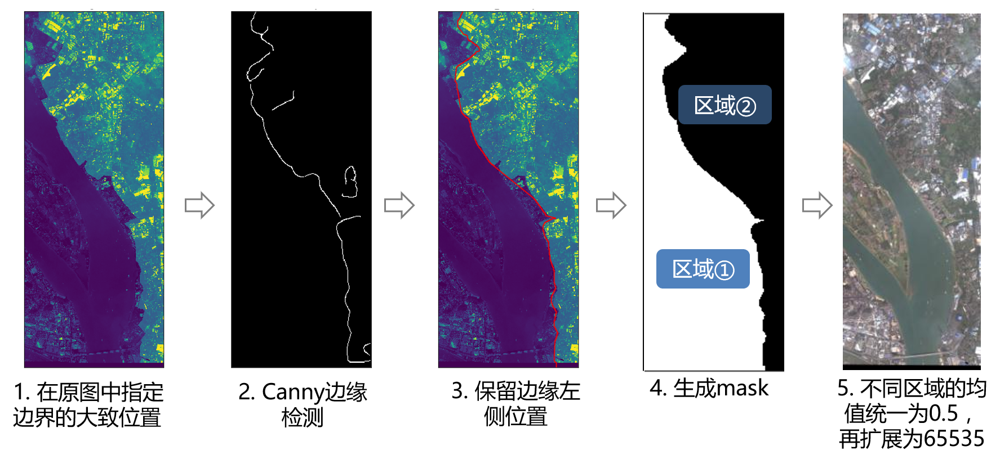

步骤1到步骤4的代码请参考[genrate_mask.ipynb][genrate_mask.ipynb](需要人工交互操作)，步骤5的代码请参考[denoise.py][denoise.py]，该操作的核心代码如下：

```python
t = img.astype(np.float32)
# 减小异常值的影响
maxv = np.percentile(t[mask], 99)
minv = np.percentile(t[mask], 1)
t[mask] = (t[mask]-minv)/(maxv-minv)
meanv = t[mask].mean()
# 均值统一拉到0.5
t[mask] += (0.5-meanv)
# 扩大范围至0-65535
t[mask] *= 65535
t[t<0] = 0
t[t>65535] = 65535
img = t.astype(np.uint16)
```

### 手工标注
如下图，标注训练数据时，我们只挑选一些有代表性的区域进行标注，保证在选择的区域内，标注的白色区域一定是房子变化，而黑色区域一定不是。得到所选区域的标签后，再分割成多个小图像组成我们数据集。

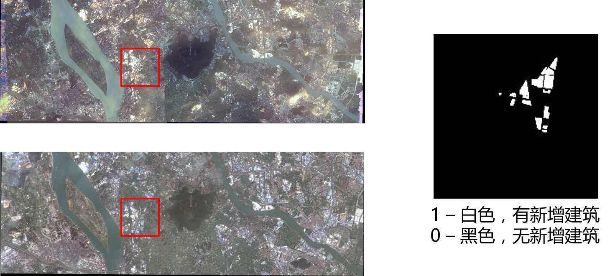

从手工标注的mask图像到训练用到的.npy文件，参考代码[process_mark.py][process_mark.py]，该部分的核心代码如下：

```python
d15 = im15[r_s:r_e, c_s:c_e, :]
d17 = im17[r_s:r_e, c_s:c_e, :]
m = msk[r_s:r_e, c_s:c_e, 0]
lab = m > 0
lab = lab.astype(d15.dtype)
lab = np.expand_dims(lab, 2)
d = np.concatenate([d15, d17, lab], 2)
```

读取.npy文件以生成训练用到的小图，参考代码[generators.py][generators.py]，该部分的核心代码如下：
```python
img_index = []
for ind in file_inds:
    img = self.get_img_all(ind)
    # 获取小图像的坐标
    rows, cols = self.split_image(img.shape[0],
                                  img.shape[1], target_size, gap)
    for r in rows:
        for c in cols:
            img_index.append((img, r, c))
while True:
    np.random.shuffle(img_index)
    for img, r, c in img_index:
        t = img[r:r+target_size[0], c:c+target_size[1], :].copy()
        yield t
```

### 数据增强
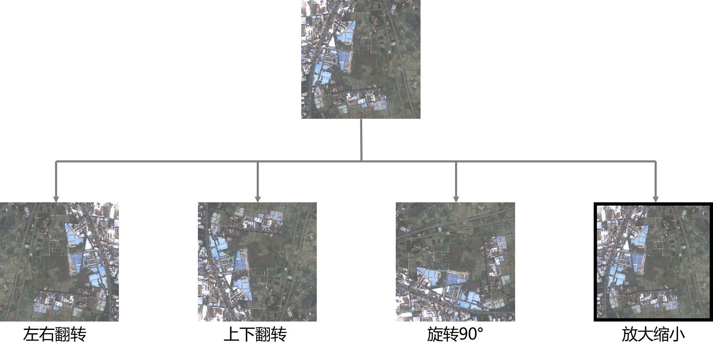

使用数据增强对提高模型的泛化能力很有帮助，目前我们只使用了上面四种增强方法，在[imgaug.py][imgaug.py]里还有其他数据增强的实现代码。

### 数据集划分
- 训练集：70%
- 验证集：20%
- 测试集：10%

## 网络训练
### 改进U-Net
使用U-Net检测新增建筑的整体流程如下：

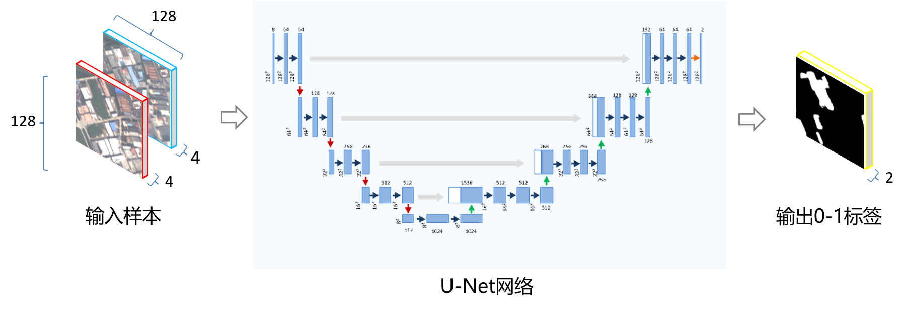

U-Net的整体架构如下：

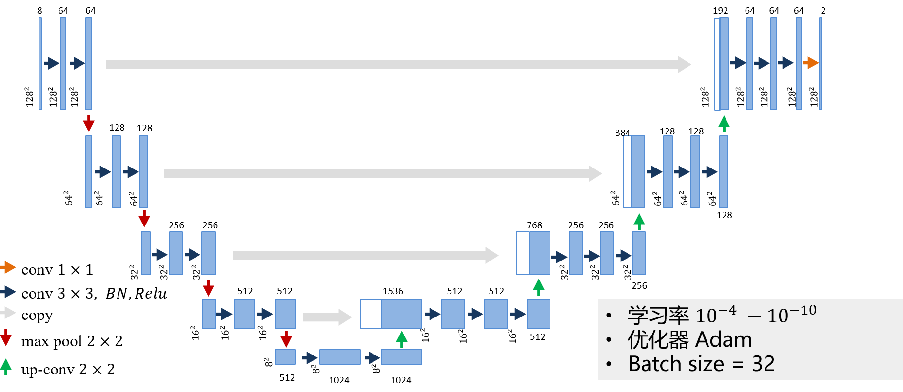

实现U-Net的代码请参考[unet.py][unet.py]。

### F1 score
我们使用F1来选择模型。将变化标签都取为正样本，变化标签外的区域都取为负样本可以得到如下F1计算公式：

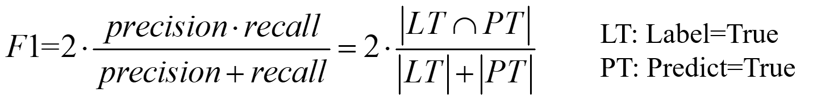

为防止部分区域无新增建筑导致除零，将上述公式修改为：

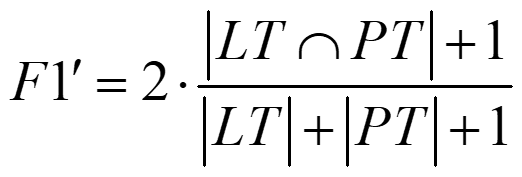

实现代码请参考[utils.py][utils.py]。

### 加权损失函数
训练模型使用的Loss函数如下：

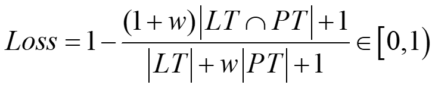

基于F𝛼推导过程如下：


- 𝛼用于调节precision和recall对度量指标的贡献度。
- 𝛼越大，precision对𝐹𝛼的贡献越大。
- 当𝛼=0.5时，两者的贡献度一致，也就是我们常用的𝐹1, 相应损失函数就是dice coefficient loss。
- 这里我们更关注正样本被检测到的概率，即recall,因此取𝛼 ≤ 0.5，即0 < w ≤ 1
根据训练经验，我们分别取权重为0.5，0.7和1.0

Loss函数的实现请参考[utils.py][utils.py]。

## 后处理
### 模型融合
将loss权重不同的模型得到的结果进行融合(像素级与操作)，如下图所示：

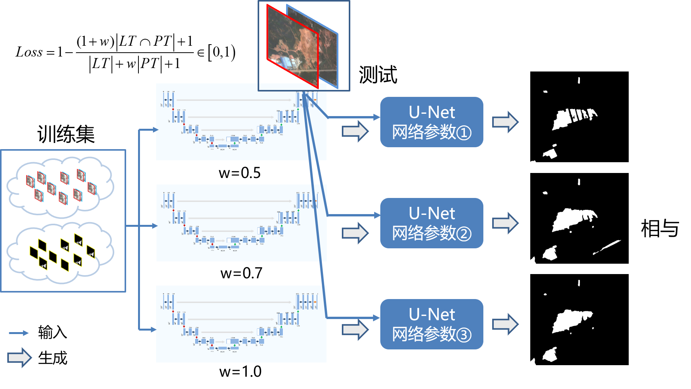

### Morphology处理
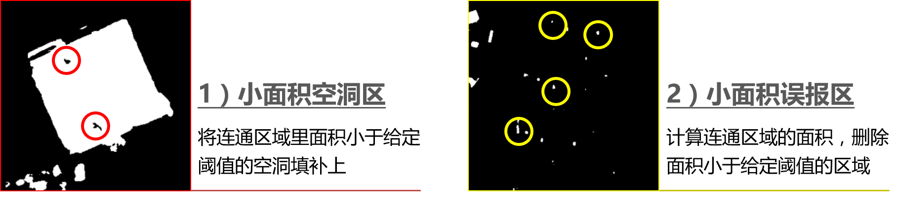

该部分的代码请参考[post_process.py][post_process.py]，其中核心代码如下：
```python
from skimage.measure import regionprops, label
from skimage.morphology import remove_small_holes
ind = remove_small_holes(label(img), min_size=min_size, connectivity=img.ndim)
img = ind.astype(np.uint8)
lab_arr = label(img)
lab_atr = regionprops(lab_arr)

def fun(atr):
    if atr.area <= area:
        min_row, min_col, max_row, max_col = atr.bbox
        t = lab_arr[min_row:max_row, min_col:max_col]
        t[t==atr.label] = 0

list(map(fun, lab_atr))
ind = lab_arr > 0
```
## 关于代码
该代码可以在本地机器或者PAI上运行。在本地运行请配置[local_config_end2end.json][local_config_end2end.json]里的相关参数；在PAI上运行，请配置[unet-end2end-rgbn.txt][unet-end2end-rgbn.txt]里的相关参数，并指定其为配置文件。
### 使用预训练模型做预测
我们公开了决赛期间使用的[权重文件][pretrained_weight]，更改配置文件里的如下几个参数，运行[end2end_best_predict.py][end2end_best_predict.py]，即可得到预测结果。
- input_path：输入数据根目录
- output_paht：输出数据根目录
- weight_path：预训练权重文件，在output_path所在目录
- origin_15：预处理之后的2015年卫星图像
- origin_17：预处理之后的2017年卫星图像
- run_name：可选(用于组成输出文件的文件名)

预测结果在output_path目录下，文件名为*run_name*-unet.zip，该压缩包里有两个文件，submit-*run_name*-unet.tiff可直接提交用于评测，view-*run_name*-unet.tiff可以用图片浏览器打开以查看预测结果。

得到预测结果之后，可根据需要运行[post_process.py][post_process.py]，进行后处理操作。

**注意** origin_15和origin_17并不是原图像，而是经过预处理的，如何预处理下面会详细介绍。

### 重新训练模型
#### 图像预处理
首先使用QGIS把原图转换成RGBA图像。QGIS打开原图，右键该图层，选择"Save as..."，弹出框(注意红框区域)如下：

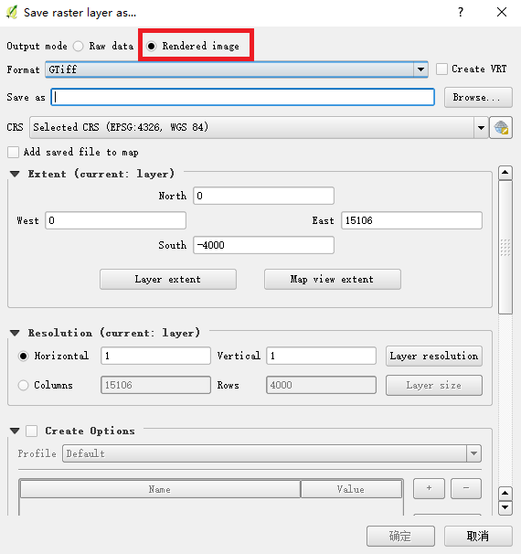

保存文件成.tif文件即可。

然后用[genrate_mask.ipynb][genrate_mask.ipynb]生成RGBA图像每个拼接区域的mask，该过程需要人工调整检测边界的参数，具体使用方法在文件里已有详细说明。

最后用[denoise.py][denoise.py]生成预处理后的图像。

#### 准备训练数据
使用[process_mark.py][process_mark.py]将手工标注的标签转换成训练模型用到的.npy文件，同时该过程还会划分数据集。使用方法代码里已有说明。

#### 训练模型
除了上面提到的几个参数，训练模型时还应注意下面两个参数：
- data_path：.npy文件所在目录
- train_val_test_config：划分训练集、验证集和测试集的文件，由[process_mark.py][process_mark.py]生成，应和代码文件在同一个目录

运行[end2end_train.py][end2end_train.py]即可。

## 总结
### 算法优势
- 预处理：解决图像拼接问题
- 八通道U-Net：直接输出房屋变化，可应对高层建筑倾斜问题
- 数据增强：增加模型泛化性，简单有效
- 加权损失函数：增强对新增建筑的检测能力
- 模型融合：取长补短，结果更全
- 后处理：直观、高效，可根据实际情况取舍
### 展望
- 更精确的区分新增道路和新建高架
- 使用CRFasRNN，使得预测的结果边界更清晰、形状更规整
- 使用更复杂的融合方式，比如stacking
### 收获
- 团结一心，其利断金
- 仔细分析数据特点，充分挖掘数据的潜在价值
- 大胆尝试，充分利用一切可用的资源
- 算法有限，想法无限；比赛虽止，奋斗不止

## 致谢
- 感谢广东省政府提供的宝贵数据
- 感谢阿里提供功能强大的平台
- 感谢天池团队辛勤的付出

## 参考资料
1. [U-Net: Convolutional Networks for Biomedical Image Segmentation](https://arxiv.org/abs/1505.04597)
2. [Batch Normalization: Accelerating Deep Network Training by Reducing Internal Covariate Shift](https://arxiv.org/abs/1502.03167)
3. [Efficient Inference in Fully Connected CRFs with Gaussian Edge Potentials](https://arxiv.org/abs/1210.5644)
4. [Conditional Random Fields as Recurrent Neural Networks](https://arxiv.org/abs/1502.03240)
5. [A Survey on Object Detection in Optical Remote Sensing Images](https://arxiv.org/abs/1603.06201)
6. [A Review on Deep Learning Techniques Applied to Semantic Segmentation](https://arxiv.org/abs/1704.06857)
7. [raster vision](https://github.com/azavea/raster-vision)
8. [awesome semantic segmentation](https://github.com/mrgloom/awesome-semantic-segmentation)
9. [deep learning models](https://github.com/fchollet/deep-learning-models)
10. [Caffe for crfasrnn](https://github.com/torrvision/caffe)
11. [imgaug](https://github.com/aleju/imgaug)
12. [tqdm](https://github.com/noamraph/tqdm)

---

[guangdongai]: https://tianchi.aliyun.com/competition/introduction.htm?spm=5176.100066.333.8.34f23564ofX6db&raceId=231615
[rank_list]:https://work.alibaba-inc.com/aliwork_tfs/g01_alibaba-inc_com/tfscom/TB1MDOKfx6I8KJjy0FgXXXXzVXa.tfsprivate.png
[genrate_mask.ipynb]: https://github.com/LiuDongjing/BuildingChangeDetector/blob/master/genrate_mask.ipynb
[denoise.py]: https://github.com/LiuDongjing/BuildingChangeDetector/blob/master/denoise.py
[process_mark.py]: https://github.com/LiuDongjing/BuildingChangeDetector/blob/master/process_mark.py
[generators.py]: https://github.com/LiuDongjing/BuildingChangeDetector/blob/master/generators.py
[imgaug.py]: https://github.com/LiuDongjing/BuildingChangeDetector/blob/master/imgaug.py
[unet.py]: https://github.com/LiuDongjing/BuildingChangeDetector/blob/master/unet.py
[utils.py]: https://github.com/LiuDongjing/BuildingChangeDetector/blob/master/utils.py
[post_process.py]: https://github.com/LiuDongjing/BuildingChangeDetector/blob/master/post_process.py
[local_config_end2end.json]: https://github.com/LiuDongjing/BuildingChangeDetector/blob/master/local_config_end2end.json
[unet-end2end-rgbn.txt]: https://github.com/LiuDongjing/BuildingChangeDetector/blob/master/unet-end2end-rgbn.txt
[pretrained_weight]: http://lyk-home.oss-cn-shanghai.aliyuncs.com/guangdong_AI/input/model_w7_v56_1117.h5?Expires=1512208674&OSSAccessKeyId=TMP.AQHti6jJBgyRyoVqKRCyrphw4K0Dq0If5fKs0nGxS37vs_N2Vwx0X2IoMDgWMC4CFQCjTMkEDWALxL4ovRohIOWL7bpwwgIVAJg0NmlSO2_7aiFzkOgGgh8-XefJ&Signature=VyPRXgzk5HCLUUd3wfThoMokG2s%3D
[end2end_best_predict.py]: https://github.com/LiuDongjing/BuildingChangeDetector/blob/master/end2end_best_predict.py
[end2end_train.py]: https://github.com/LiuDongjing/BuildingChangeDetector/blob/master/end2end_train.py
